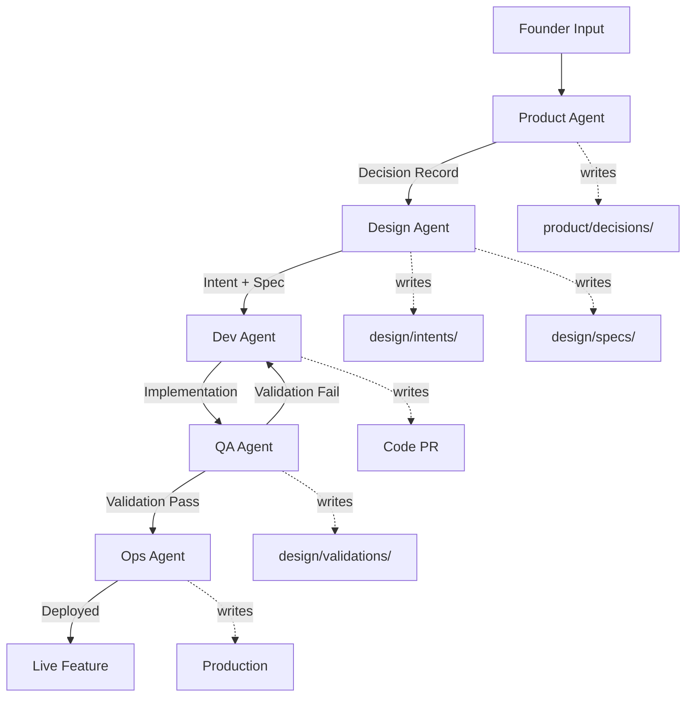

# Architecture Review: Sequential Agent Pipeline

## ✅ Your Requirements Met

### 1. Founder Input → Product Agent

**✓ Implemented**

- Founder adds feedback to `product/feedback/inbox.md` or creates GitHub issue
- Product Agent triggered via pipeline workflow
- Analyzes feedback against current beliefs
- Generates decision record + experiment proposal
- **Output**: `product/decisions/<id>.md`, updated `experiments/active.md`

### 2. Product Agent → Design Agent

**✓ Implemented**

- Design Agent triggered when pipeline state = `product_complete`
- Reads Product's decision record and experiment
- Translates product intent into interaction design
- **Output**: `design/intents/<id>.md`, `design/specs/<id>.md`

### 3. Design Agent → Dev Agent

**✓ Implemented**

- Dev Agent triggered when pipeline state = `design_complete`
- Reads design spec and intent
- Implements smallest viable change behind feature flag
- **Output**: Pull Request with code, feature flag config

### 4. Dev Agent → QA Agent

**✓ Implemented**

- QA Agent triggered when PR merged and state = `dev_complete`
- Validates implementation matches design intent
- Tests reversibility and unhappy paths
- **Output**: `design/validations/<id>.md`
- **Rollback**: If fails, returns to Dev stage

### 5. QA Agent → Ops Agent (Rollout)

**✓ Implemented**

- Ops Agent triggered when state = `qa_complete`
- Performs gradual rollout with monitoring
- Confirms rollback plan ready
- **Output**: Feature live in production

---

## Architecture Components

### File Structure

```
.ai/
  agents/           # 5 agent definitions with pipeline context
  workflows/        # Orchestration logic
  pipeline/         # State files tracking progress
  PIPELINE.md       # Architecture documentation

product/
  feedback/inbox.md # Founder input
  decisions/        # Product agent outputs
  beliefs/          # Tested hypotheses

design/
  intents/          # Design agent: why + feel
  specs/            # Design agent: how + structure
  validations/      # QA agent: validation results

engineering/
  decisions/        # Dev agent: architecture changes
  architecture.md   # Dev constraints
  standards.md      # Dev coding rules

experiments/
  active.md         # Current experiment tracking

.github/workflows/
  pipeline.yml      # Orchestrates sequential execution
```

### State Management

**State file**: `.ai/pipeline/<feature-id>.state`

Tracks progress through 5 stages:

1. `intake` → Product analyzing
2. `product_complete` → Ready for Design
3. `design_complete` → Ready for Dev
4. `dev_complete` → Ready for QA
5. `qa_complete` → Ready for Ops
6. `deployed` → Live in production

### Orchestration Flow



---

## How to Use

### Start New Feature

```bash
# 1. Founder adds feedback
echo "Onboarding feels confusing" >> product/feedback/inbox.md

# 2. Start pipeline
gh workflow run pipeline.yml \
  -f feature_id=onboarding-v2 \
  -f stage=intake

# 3. Pipeline auto-advances through stages
# Each agent completes its work and updates state
```

### Check Progress

```bash
# View current state
cat .ai/pipeline/onboarding-v2.state

# Output shows:
# status: design_complete
# stages:
#   product: ✓ 2026-01-28
#   design: ✓ 2026-01-29
#   dev: in_progress
#   qa: pending
#   ops: pending
```

### Manual Intervention

If stage is `blocked`, founder reviews and decides:

- Reduce scope (Product Agent)
- Clarify intent (Design Agent)
- Simplify implementation (Dev Agent)
- Accept limitation (QA Agent)

---

## Key Principles Enforced

✅ **Single-threaded**: One experiment active at a time  
✅ **Sequential**: No stage skipping  
✅ **Blocking**: Each stage must complete before next  
✅ **Reversible**: All changes can be rolled back  
✅ **Belief-driven**: Every change ties to hypothesis  
✅ **Minimal scope**: Smallest viable change  
✅ **State-tracked**: Full audit trail

---

## What's Different from Standard Dev?

| Traditional         | AID Pipeline             |
| ------------------- | ------------------------ |
| Build features      | Test beliefs             |
| Design then build   | Analyze → Design → Build |
| Manual coordination | Automated handoffs       |
| Implicit decisions  | Documented decisions     |
| Large releases      | Minimal experiments      |
| Optional QA         | Mandatory validation     |
| Deploy when ready   | Deploy when proven       |

---

## Next Steps

1. **Test the pipeline** with a real feature
2. **Integrate Copilot agents** to automate each stage
3. **Add monitoring** to track experiment success signals
4. **Iterate** on orchestration based on actual use

Your architecture is ready! 🚀
