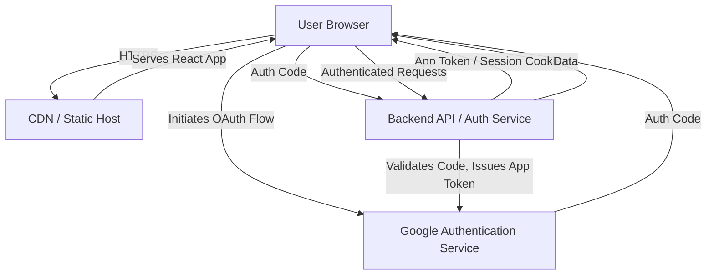

# Technical Specification: Foundational Frontend Architecture (error-fix-1770408316888)

## Architecture Overview
The frontend will be a **Client-Side Rendered (CSR) React application**, built with **TypeScript**, and styled using **Shadcn UI** components (based on Tailwind CSS and Radix UI). It will be deployed as **static assets** via a Content Delivery Network (CDN) for high availability and performance. User authentication will be handled via **Google OAuth 2.0 / OpenID Connect**, involving a minimal backend component for secure token exchange and session management. Communication with the backend will occur over **HTTPS** via a RESTful API.

## Components

### Core Application Structure
-   `src/App.tsx`: Root component, handles global state (e.g., authentication status) and routing.
-   `src/index.tsx`: Entry point for React application.
-   `src/lib/utils.ts`: Utility functions, including `cn` for Tailwind class merging.

### Layout Components
-   `src/components/layout/AuthLayout.tsx`: Wrapper for unauthenticated routes (e.g., Login screen).
-   `src/components/layout/DashboardLayout.tsx`: Wrapper for authenticated routes, including header (product name, logout button) and main content area.

### Page Components
-   `src/pages/LoginPage.tsx`: Displays the 