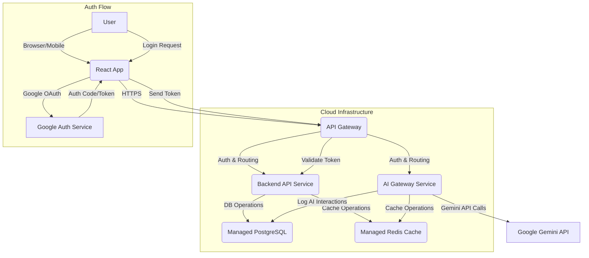

# Technical Specification: Foundational Web App with Gemini AI Integration

## Architecture Overview
The system will adopt a microservice-oriented architecture hosted on a public cloud provider, leveraging managed services for scalability, reliability, and reduced operational overhead. It consists of a client-side React application, an API Gateway, a core Backend API service, a dedicated AI Gateway service for Gemini integration, and managed data stores.



## Components

-   **Frontend (React App)**:
    -   **Purpose**: User interface, responsible for rendering UI components using Shadcn, handling user interactions, and initiating Google OAuth login flow.
    -   **Responsibilities**: Displaying dashboards, making authenticated API calls to the API Gateway, managing client-side state.
-   **API Gateway**:
    -   **Purpose**: Single entry point for all client requests, providing security, routing, and traffic management.
    -   **Responsibilities**: Authentication (JWT validation), authorization, request routing to appropriate backend/AI services, rate limiting, Web Application Firewall (WAF) protection.
-   **Backend API Service**:
    -   **Purpose**: Core business logic, user management, and data persistence for structured application data.
    -   **Responsibilities**: User registration/profile management, dashboard data aggregation, feature configuration, interacting with PostgreSQL and Redis.
    -   **Technology**: Stateless RESTful API, e.g., Python/FastAPI, Node.js/Express, Spring Boot.
-   **AI Gateway Service**:
    -   **Purpose**: Dedicated service for managing all interactions with the Google Gemini API.
    -   **Responsibilities**: Prompt engineering, input/output validation for AI requests, handling Gemini API calls, parsing responses, error handling, caching AI responses, logging AI interaction details.
    -   **Technology**: Dedicated microservice, e.g., Python/FastAPI for easy integration with AI libraries.
-   **PostgreSQL (Managed)**:
    -   **Purpose**: Primary data store for structured application data.
    -   **Responsibilities**: Storing user profiles, feature configurations, AI interaction logs, and other relational data.
    -   **Technology**: AWS RDS PostgreSQL, Google Cloud SQL for PostgreSQL.
-   **Redis (Managed)**:
    -   **Purpose**: In-memory data store for caching and session management.
    -   **Responsibilities**: Caching frequently accessed data, storing user sessions, caching AI responses to reduce API calls.
    -   **Technology**: AWS ElastiCache for Redis, Google Cloud Memorystore for Redis.
-   **Google OAuth Service**:
    -   **Purpose**: External identity provider for user authentication.
    -   **Responsibilities**: Authenticating users via their Google accounts and issuing ID tokens/access tokens.

## Data Models

```json
{
  "User": {
    "id": "UUID",
    "google_id": "string",
    "email": "string",
    "name": "string",
    "profile_picture_url": "string | null",
    "created_at": "timestamp",
    "updated_at": "timestamp"
  },
  "FeatureConfig": {
    "id": "UUID",
    "user_id": "UUID",
    "feature_name": "string",
    "config_json": "jsonb",
    "created_at": "timestamp",
    "updated_at": "timestamp"
  },
  "AIInteractionLog": {
    "id": "UUID",
    "user_id": "UUID | null",
    "prompt_text": "text",
    "response_text": "text",
    "model_id": "string",
    "request_cost_usd": "decimal",
    "latency_ms": "integer",
    "timestamp": "timestamp",
    "status": "enum (success, failed)",
    "error_message": "text | null"
  }
}
```

## APIs

### Authentication
-   **Endpoint**: `POST /auth/google/login`
    -   **Description**: Initiates the Google OAuth flow. Frontend redirects to Google, which then redirects back with an authorization code/token.
    -   **Request**: (Handled by client-side Google OAuth SDK)
    -   **Response**: JWT token issued by the backend upon successful Google verification.

### Backend API Service Endpoints
-   **Endpoint**: `GET /api/dashboard`
    -   **Description**: Retrieves aggregated data for the user's dashboard.
    -   **Authentication**: Required (Valid JWT in `Authorization` header).
    -   **Request**: No body.
    -   **Response (200 OK)**:
        ```json
        {
          "user_info": { /* ... */ },
          "recent_activities": [ /* ... */ ],
          "feature_status": { /* ... */ }
        }
        ```
    -   **Error Handling**: 401 Unauthorized, 500 Internal Server Error.

-   **Endpoint**: `PUT /api/user/profile`
    -   **Description**: Updates the authenticated user's profile information.
    -   **Authentication**: Required.
    -   **Request (application/json)**:
        ```json
        {
          "name": "string | null",
          "profile_picture_url": "string | null"
        }
        ```
    -   **Response (200 OK)**: Updated `User` object.

### AI Gateway Service Endpoints
-   **Endpoint**: `POST /api/ai/generate`
    -   **Description**: Sends a prompt to the AI Gateway, which then interacts with the Google Gemini API.
    -   **Authentication**: Required (Valid JWT).
    -   **Request (application/json)**:
        ```json
        {
          "prompt": "string",
          "context": {
            "user_id": "UUID",
            "feature_id": "string",
            "conversation_history": "array<string> | null"
          },
          "model_config": {
            "temperature": "number | null",
            "max_tokens": "integer | null"
          }
        }
        ```
    -   **Response (200 OK)**:
        ```json
        {
          "output": "string",
          "metadata": {
            "model_id": "string",
            "cost_usd": "decimal",
            "latency_ms": "integer",
            "cached": "boolean"
          }
        }
        ```
    -   **Error Handling**: 400 Bad Request (invalid prompt/context), 401 Unauthorized, 429 Too Many Requests (rate limit), 502 Bad Gateway (Gemini API error), 500 Internal Server Error.

## Infrastructure

-   **Frontend Hosting**: Static site hosting with CDN (e.g., AWS S3 + CloudFront, Google Cloud Storage + CDN) for low latency and high availability.
-   **Backend & AI Services**: Containerized services deployed on fully managed serverless platforms (e.g., Google Cloud Run, AWS Fargate, Azure Container Apps) for auto-scaling, zero-downtime deployments, and reduced operational overhead.
-   **Database**: Managed PostgreSQL instance (e.g., AWS RDS, Google Cloud SQL) configured for high availability (multi-AZ deployment) and automated backups.
-   **Cache**: Managed Redis instance (e.g., AWS ElastiCache, Google Cloud Memorystore) for high-performance caching.
-   **API Gateway**: Cloud provider's API Gateway service (e.g., AWS API Gateway, Google Cloud API Gateway) for traffic management, security, and integration with WAF.
-   **Monitoring & Logging**: Integrated cloud monitoring services (e.g., AWS CloudWatch, Google Cloud Monitoring/Logging) for metrics, logs, and alerts. Distributed tracing (e.g., OpenTelemetry, X-Ray, Cloud Trace) for inter-service visibility.
-   **Secrets Management**: Cloud provider's secret manager (e.g., AWS Secrets Manager, Google Secret Manager) for API keys, database credentials, and other sensitive information.
-   **Infrastructure as Code (IaC)**: Terraform will be used to define and provision all cloud resources, ensuring consistency and repeatability.

## Testing Strategy

-   **Unit Tests**: Comprehensive unit tests for all individual functions, classes, and components in the frontend, backend, and AI Gateway services. Focus on business logic, data transformations, and API request/response parsing.
-   **Integration Tests**: 
    -   API endpoint tests: Verify correct request/response handling, authentication, and authorization.
    -   Service-to-service communication tests: Ensure proper interaction between backend, AI Gateway, and data stores.
    -   Database integration tests: Validate ORM/database interactions.
    -   AI Integration tests: Verify correct prompt construction, Gemini API calls, and response parsing, including edge cases and error conditions.
-   **End-to-End (E2E) Tests**: Simulate full user journeys, from Google login to dashboard interaction and AI feature usage, to ensure all components work together seamlessly.
-   **Performance Tests**: 
    -   Load testing on API endpoints to identify bottlenecks and validate scaling capabilities.
    -   Benchmarking AI Gateway latency and throughput with varying prompt complexities.
    -   Database query performance analysis.
-   **Security Tests**: 
    -   Regular vulnerability scanning and penetration testing.
    -   OWASP Top 10 adherence for web application security.
    -   Specific tests for AI vulnerabilities, including prompt injection, data leakage, and adversarial attacks on the AI Gateway.
-   **Monitoring & Alerting Tests**: Verify that critical metrics are being collected and alerts are triggered correctly for predefined thresholds (e.g., high error rates, increased latency, AI cost spikes).

## Deployment

-   **CI/CD Pipeline**: Automated CI/CD pipelines (e.g., GitHub Actions, GitLab CI, Jenkins, Cloud Build) for each service, triggered on code commits to main branches.
-   **Build & Test**: Pipelines will include linting, unit tests, integration tests, and security scans.
-   **Deployment Strategy**: 
    -   **Frontend**: Automatically deployed to static hosting/CDN upon successful build.
    -   **Backend & AI Services**: Blue/Green or Canary deployment strategies will be employed to minimize downtime and risk during updates. This involves deploying new versions alongside old ones and gradually shifting traffic.
-   **Feature Flags**: Implement feature flags to enable/disable new features (especially AI-driven ones) dynamically in production, allowing for controlled rollouts and A/B testing.
-   **Rollback**: Automated rollback procedures in case of critical failures during deployment.
-   **Monitoring & Alerts**: Deployment pipelines will integrate with monitoring systems to ensure new deployments are healthy and trigger alerts on anomalies.
