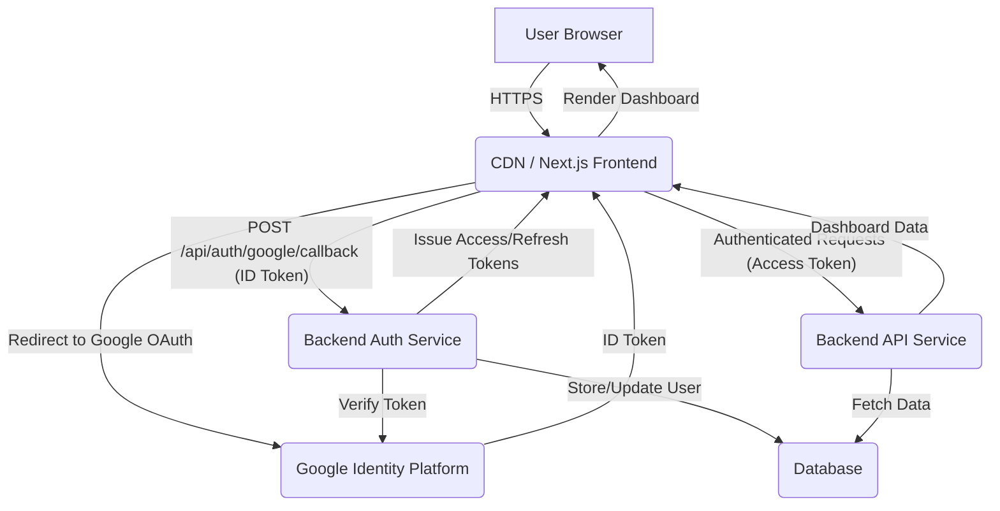

# Technical Specification: Foundational UI (Google Login & Basic Dashboard)

## Architecture Overview

The system will comprise a client-side React application, preferably built with Next.js, hosted on a Content Delivery Network (CDN) for optimal performance. User authentication will be handled via Google OAuth 2.0, with a dedicated backend Authentication Service responsible for verifying Google ID tokens, managing user profiles, and issuing application-specific JSON Web Tokens (JWTs) for session management. A separate Backend API Service will serve dashboard data, secured by these JWTs. A persistent database will store user profiles and application data.



## Components

-   **Frontend (React Application - Next.js Recommended):**
    -   **Login Page:** Presents a "Sign in with Google" button. Initiates Google OAuth flow and handles the redirect callback from Google.
    -   **Dashboard Page:** Displays a welcome message and placeholder content. Makes authenticated API calls to fetch dashboard-specific data.
    -   **Design System:** Integrates `shadcn/ui` components for a consistent visual language and accessible UI elements.
    -   **Routing:** Client-side routing managed by Next.js or React Router.
    -   **State Management:** Utilizes React Context API, Zustand, or similar for application-wide state management (e.g., user authentication status).
    -   **Error Boundaries:** Implements React Error Boundaries for graceful handling of rendering errors.

-   **Backend Authentication Service:**
    -   **Endpoint: `POST /api/auth/google/callback`:** Receives the Google ID token from the frontend. Verifies the token's authenticity and integrity with Google's API. Based on the verified identity, it creates a new user record or retrieves an existing one from the database. It then issues a short-lived `accessToken` (JWT) and a longer-lived `refreshToken` (JWT) to the client.
    -   **Endpoint: `POST /api/auth/refresh`:** Accepts a valid `refreshToken` (typically from an `httpOnly` cookie) and issues a new `accessToken` if the refresh token is valid and not expired.
    -   **User Store:** Interacts with the database to manage user profiles (create, retrieve, update).

-   **Backend API Service (for Dashboard Data):**
    -   **Endpoint: `GET /api/dashboard`:** Requires a valid `accessToken` in the `Authorization: Bearer` header. Fetches and returns basic dashboard data. This service will be stateless and horizontally scalable.

## Data Models

-   **User (Database Table/Collection):**
    ```json
    {
      "id": "UUID or unique identifier",
      "googleId": "string",       // Unique ID from Google
      "email": "string",        // User's email (unique, indexed)
      "name": "string",         // User's full name
      "avatarUrl": "string?",   // Optional URL to user's Google profile picture
      "createdAt": "datetime",    // Timestamp of user creation
      "lastLogin": "datetime",    // Timestamp of last successful login
      "isActive": "boolean"     // Flag for account status (e.g., for future admin features)
    }
    ```

## APIs

### 1. Google OAuth 2.0 Flow

-   **Initiation:** Frontend redirects user to Google's authorization endpoint.
-   **Callback:** Google redirects user back to frontend with an `id_token` (JWT) in the URL fragment or POST body.

### 2. Authentication Service APIs

-   **Endpoint: `POST /api/auth/google/callback`**
    -   **Purpose:** Verify Google ID token and establish application session.
    -   **Request:**
        ```json
        {
          "id_token": "<Google_ID_Token_JWT>"
        }
        ```
    -   **Response (Success - HTTP 200 OK):**
        ```json
        {
          "accessToken": "<Application_Access_Token_JWT>",
          "refreshToken": "<Application_Refresh_Token_JWT>",
          "user": {
            "id": "<user_id>",
            "name": "<user_name>",
            "email": "<user_email>",
            "avatarUrl": "<user_avatar_url>"
          }
        }
        ```
    -   **Response (Error - HTTP 401 Unauthorized / 403 Forbidden):**
        ```json
        {
          "message": "Sign-in failed. Please try again." // Or "You don't have access..."
        }
        ```

-   **Endpoint: `POST /api/auth/refresh`**
    -   **Purpose:** Obtain a new access token using a valid refresh token.
    -   **Request:** (Refresh token expected in an `httpOnly`, `secure` cookie).
    -   **Response (Success - HTTP 200 OK):**
        ```json
        {
          "accessToken": "<New_Application_Access_Token_JWT>"
        }
        ```
    -   **Response (Error - HTTP 401 Unauthorized):**
        ```json
        {
          "message": "Session expired. Please sign in again."
        }
        ```

### 3. Backend API Service APIs

-   **Endpoint: `GET /api/dashboard`**
    -   **Purpose:** Retrieve data for the user's dashboard.
    -   **Request:** (Access token expected in `Authorization: Bearer <Access_Token_JWT>` header).
    -   **Response (Success - HTTP 200 OK):**
        ```json
        {
          "message": "Welcome, [User Name]!",
          "data": { /* Placeholder for future dashboard content */ }
        }
        ```
    -   **Response (Error - HTTP 401 Unauthorized / 403 Forbidden):**
        ```json
        {
          "message": "Unauthorized access. Please log in."
        }
        ```

## Infrastructure

-   **Frontend Hosting:** Vercel, Netlify (for Next.js deployments), or AWS S3 + CloudFront for static asset hosting and global content delivery.
-   **Backend Services (Auth & API):**
    -   **Serverless:** AWS Lambda + API Gateway, Google Cloud Functions, Azure Functions (cost-effective for low-to-moderate scale, auto-scaling).
    -   **Containerized:** AWS ECS/EKS, Google Cloud Run, Azure App Service (for more control and consistent environment).
-   **Database:** AWS RDS (PostgreSQL), Google Cloud SQL (PostgreSQL), or Azure Database for PostgreSQL (managed relational database for user profiles).
-   **DNS:** Standard DNS provider for domain management.
-   **CDN:** Integrated with frontend hosting solution or a separate service like AWS CloudFront for caching and accelerating static assets.

## Testing Strategy

-   **Unit Tests:**
    -   **Frontend:** Jest and React Testing Library for individual React components (e.g., LoginButton, DashboardLayout, shadcn components).
    -   **Backend:** Jest or Mocha for individual API route handlers, token verification logic, and database interaction functions.
-   **Integration Tests:**
    -   Verify the complete authentication flow: Google ID token reception, backend verification, token issuance, and subsequent authenticated API calls.
    -   Test interactions between frontend components and backend APIs (e.g., successful dashboard data fetch).
-   **End-to-End (E2E) Tests:**
    -   Cypress or Playwright to simulate full user journeys: navigating to the login page, clicking "Sign in with Google", completing the OAuth flow, and successfully accessing the dashboard.
-   **Security Tests:**
    -   Manual and automated penetration testing for the authentication service and all API endpoints.
    -   Vulnerability scanning of dependencies.
    -   Adherence to OWASP Top 10 for web applications and OWASP API Security Top 10.
-   **Performance Tests:**
    -   Lighthouse CI or similar tools for frontend performance metrics (Core Web Vitals).
    -   Load testing for backend authentication and API endpoints to ensure scalability under anticipated user loads.

## Deployment

-   **Frontend (Next.js):**
    -   CI/CD pipeline (e.g., GitHub Actions, GitLab CI, Vercel/Netlify built-in) triggered on main branch commits.
    -   Automated build, test, and deployment to the chosen hosting platform (Vercel, Netlify, S3/CloudFront).
    -   Rollback strategy: Ability to quickly revert to a previous working version.
-   **Backend Services:**
    -   CI/CD pipeline deploying container images to ECS/Cloud Run or updating serverless functions.
    -   Blue/Green deployments or canary releases for critical services to minimize downtime during updates.
-   **Feature Flags:** While not strictly necessary for this foundational setup, a feature flag system can be integrated early for future, more complex dashboard features to enable controlled rollouts and A/B testing.
-   **Monitoring and Alerts:** Integrate with cloud-native monitoring solutions (AWS CloudWatch, Google Cloud Monitoring) or third-party tools (Datadog, Prometheus/Grafana) for:
    -   **Metrics:** API latency, error rates (HTTP 5xx), successful/failed login attempts, resource utilization (CPU, memory).
    -   **Logs:** Centralized logging for all frontend and backend services.
    -   **Alerts:** Configure alerts for critical events (e.g., high error rates, unauthorized access attempts, service downtime).